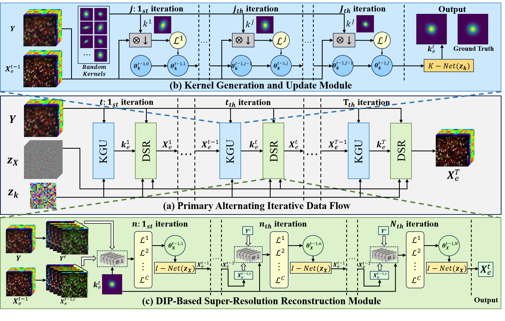

# SAKE: Unsupervised HSI Super-Resolution via Adaptive Kernel Estimation and Reconstruction, GRSL

 ---

> Methods for hyperspectral image (HSI) super-resolution employing deep learning have been pivotal in a range of fields. Despite this, many current approaches face challenges like the scarcity of paired datasets, simplified degradation models, and a lack of image prior information, leading to weak generalization over different datasets and degradation conditions. To overcome these challenges, this paper introduces a single hyperspectral image blind super-resolution algorithm supplemented by an unsupervised blur kernel estimation module.
Random kernels from Gaussian distributions form pseudo-label kernels to handle arbitrary degradation kernels. These are processed by a DIP-based network, channel-by-channel, using a batch gradient acceleration algorithm for network parameter updates. This unsupervised, pre-training-free method achieves single HSI super-resolution through alternating iterative optimization. This method necessitates solely the input of the degraded image and requires no extra data, demonstrating a minimal reliance on data.
Simulated experiments across datasets and scenarios demonstrate the proposed method's superior ability to estimate degradation blur kernels, outperforming existing state-of-the-art methods.
<p align="center">
   
</p>

## Requirements
- pip install numpy torch blobfile tqdm pyYaml pillow    # e.g. torch 1.7.1+cu110.

## Data Preparation for SAKE
To prepare testing data, please organize images as `data/datasets/Salinas/HR/Salinas_crop.mat`, and run this command:
```bash
cd SAKE/data
python prepare_dataset.py --model SAKE --sf 4 --dataset Salinas
```

## Run SAKE
In a conventional blind super-resolution scenario, run this command:
```bash
cd SAKE
python main_HSI.py
```
## Result Viewing
The super-resolution experimental results can be found in the `SAKE/data/log_SAKE/` folder.

---

Commonly used datasets can be downloaded [here](https://www.ehu.eus/ccwintco/index.php/Hyperspectral_Remote_Sensing_Scenes).


## Acknowledgement

This project is released under the Apache 2.0 license. The codes are based on [DKP](https://github.com/XYLGroup/DKP) . Please also follow their licenses. Thanks for their great works.


